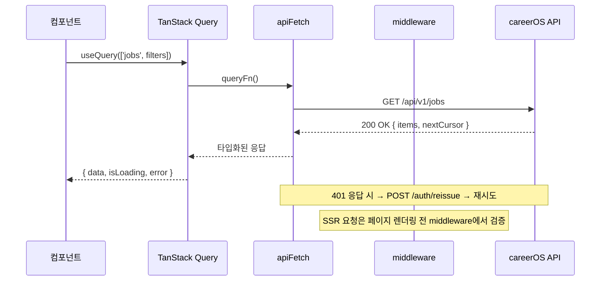

# 아키텍처 개요

[English](./architecture.md) | 🇰🇷 **한국어**

---

## 레이어 구조

```
브라우저
  └── Next.js 15 (App Router)
        ├── middleware.ts          — JWT 검증, 토큰 갱신, 역할 확인
        ├── (public)/             — /login, /signup (인증 불필요)
        ├── (auth)/layout.tsx     — AppShell (사이드바 + 탑바)
        │     └── 페이지들         — TanStack Query 훅 → apiFetch → careerOS API
        └── (admin)/layout.tsx    — AppShell + ADMIN 역할 게이트
```

---

## 데이터 흐름



---

## 파일 구조

```
src/
├── app/
│   ├── (public)/
│   │   ├── login/page.tsx
│   │   └── signup/page.tsx
│   ├── (auth)/
│   │   ├── layout.tsx            ← AppShell (사이드바 + 탑바)
│   │   ├── dashboard/page.tsx
│   │   ├── jobs/
│   │   │   ├── page.tsx
│   │   │   └── [jobId]/page.tsx
│   │   ├── matches/
│   │   │   ├── page.tsx
│   │   │   └── [matchId]/page.tsx
│   │   ├── resume/page.tsx
│   │   ├── github/page.tsx
│   │   ├── candidate/page.tsx
│   │   ├── advisor/
│   │   │   ├── page.tsx
│   │   │   └── reports/[reportId]/page.tsx
│   │   ├── notifications/page.tsx
│   │   └── settings/page.tsx
│   ├── (admin)/
│   │   ├── layout.tsx            ← AdminShell (AppShell + 역할 게이트)
│   │   └── admin/
│   │       ├── page.tsx          → /admin (리다이렉트 /admin/users)
│   │       ├── users/page.tsx
│   │       ├── jobs/page.tsx
│   │       └── ai-calls/page.tsx
│   └── api/
│       └── auth/callback/route.ts
├── components/
│   ├── MatchScoreBadge.tsx
│   ├── JobCard.tsx
│   ├── CursorList.tsx
│   ├── ScoreBreakdownChart.tsx
│   ├── ResumeUploader.tsx
│   └── ui/                       ← 레이아웃 + 패턴 프리미티브
│       ├── AppShell.tsx
│       ├── Sidebar.tsx
│       ├── Topbar.tsx
│       ├── Toast.tsx
│       ├── Modal.tsx
│       └── Spinner.tsx
├── lib/
│   └── api/
│       ├── client.ts             ← apiFetch 래퍼
│       ├── auth.ts
│       ├── jobs.ts
│       ├── matches.ts
│       ├── resume.ts
│       ├── github.ts
│       ├── candidate.ts
│       ├── advisor.ts
│       ├── notifications.ts
│       ├── users.ts
│       ├── admin.ts
│       └── taxonomy.ts
├── stores/
│   ├── authStore.ts
│   └── notificationStore.ts
└── middleware.ts
```

---

## 인증 흐름 (전체)

```
1. 사용자가 /dashboard 접속
2. middleware.ts가 access_token 쿠키 확인
   a. 유효 → 페이지 진입
   b. 만료 → POST /auth/reissue (refresh_token 쿠키)
              → 성공: 새 access_token 발급 → 진입
              → 실패: /login?redirect=/dashboard 리다이렉트
3. 페이지 로드 → (auth)/layout.tsx가 AppShell 렌더링
4. 페이지 컴포넌트가 useQuery 호출 → apiFetch 실행
5. apiFetch에서 401 (레이스 컨디션) → 동일 갱신 로직 → 1회 재시도
```

---

## 에러 처리 전략

| 레이어 | 방식 | 동작 |
|--------|------|------|
| 네트워크/API | `apiFetch`가 `ApiError` throw | careerOS 응답 봉투의 `code` + `message` |
| 쿼리 에러 | TanStack Query `error` | 컴포넌트의 `isError`로 전파 |
| 컴포넌트 | `useEffect`에서 `isError` 감지 | 토스트 알림 표시 |
| 페이지 레벨 | React Error Boundary | 라우트 세그먼트별 `/error.tsx` 폴백 |
| 인증 에러 (401) | `apiFetch` 재시도 로직 | 자동 갱신 → 실패 시 `/login` 리다이렉트 |

---

## 로딩 전략

| 상황 | 패턴 |
|------|------|
| 리스트 페이지 (jobs, matches) | 스켈레톤 카드 (3개 플레이스홀더) |
| 상세 페이지 | 스켈레톤 섹션 |
| 뮤테이션 버튼 (저장, 숨기기, 업로드) | 버튼 내부 인라인 스피너 |
| 페이지 최초 로드 | Next.js `loading.tsx`를 통한 스켈레톤 |

전체 화면 스피너는 어떤 경우에도 사용하지 않음. 인라인 로딩만.

---

## 핵심 제약 사항

- JWT는 HTTP-only — JS에서 `document.cookie` 직접 접근 금지
- 모든 서버 상태는 TanStack Query — fetch 데이터에 `useState` 사용 금지
- 커서 페이지네이션만 — offset/페이지 번호 방식 사용 금지
- Tailwind 유틸리티 클래스만 — 토큰 정의 제외 커스텀 CSS 금지
- 명시적 결정 없이 새 npm 패키지 추가 금지 — 기존 의존성 먼저 확인

---

[Wiki 인덱스](README.ko.md) | [페이지 라우팅 ▶](routing.ko.md)
