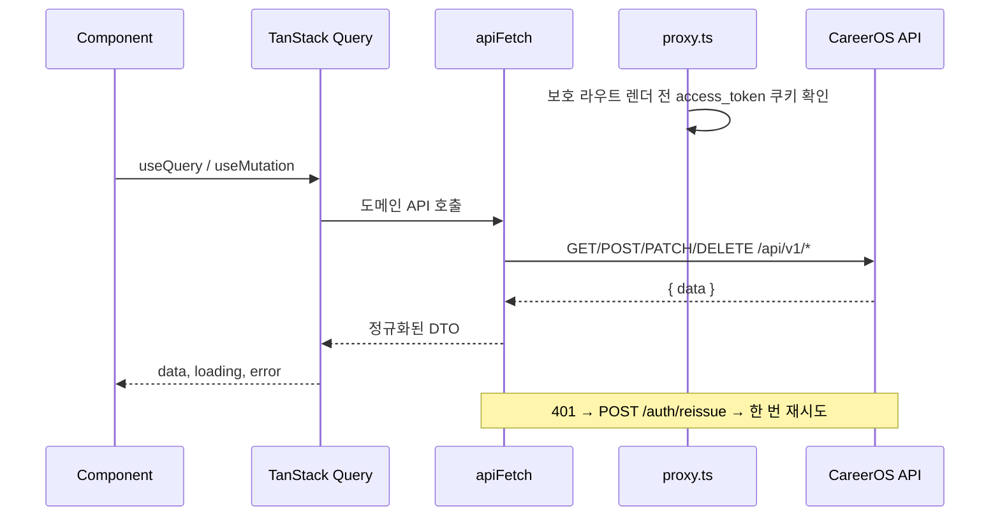

# 아키텍처 개요

[English](./architecture.md) | 🇰🇷 **한국어**

## 레이어 구조

```
Browser
  └── Next.js App Router
        ├── src/proxy.ts          — 라우트 보호 + ADMIN role 확인
        ├── (public)/             — 랜딩과 인증 진입 페이지
        ├── (auth)/layout.tsx     — dark assistant app shell
        ├── (admin)/layout.tsx    — admin shell
        ├── TanStack Query        — 서버 상태와 캐시
        └── src/lib/api/*         — 타입 기반 API 모듈 + DTO adapter
```

## 데이터 흐름



## 디자인 시스템

인증/관리자 페이지는 `src/app/globals.css`의 `dark-app` 토큰을 사용합니다. 방향은 neutral-first입니다. 검은 표면, 흰 타이포그래피, 절제된 border, 은은한 motion, 제한된 accent만 사용합니다.

## 핵심 제약

- 클라이언트 JS에서 JWT 쿠키를 읽지 않습니다.
- 서버 상태는 TanStack Query에 둡니다.
- 백엔드 DTO 차이는 `src/lib/api/adapters.ts`에서 처리합니다.
- 페이지별 색상 하드코딩보다 공유 UI primitive와 design token을 우선합니다.
- 목록 계약은 cursor pagination을 기본으로 합니다.

[위키 인덱스](README.ko.md) | [라우팅 ▶](routing.ko.md)
