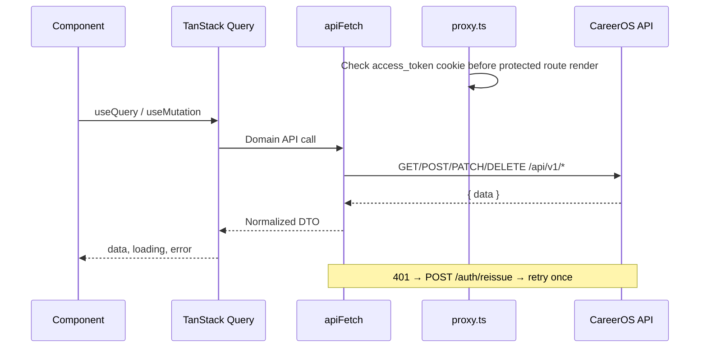

# Architecture Overview

🌐 **English** | [한국어](./architecture.ko.md)

## Layer Map

```
Browser
  └── Next.js App Router
        ├── src/proxy.ts          — route guard + ADMIN role check
        ├── (public)/             — landing and auth entry pages
        ├── (auth)/layout.tsx     — dark assistant app shell
        ├── (admin)/layout.tsx    — admin shell
        ├── TanStack Query        — server state and cache
        └── src/lib/api/*         — typed API modules + DTO adapters
```

## Data Flow



## Design System

Authenticated and admin pages use the `dark-app` token system in `src/app/globals.css`. The visual direction is neutral-first: black surfaces, white typography, restrained borders, subtle motion, and limited accent color for selected/saved/primary states.

## Key Constraints

- Do not read JWT cookies from client JavaScript.
- Keep server state in TanStack Query.
- Keep backend DTO drift inside `src/lib/api/adapters.ts`.
- Prefer shared UI primitives and design tokens over page-level color hardcoding.
- Cursor pagination is the default list contract.

[Wiki Index](README.md) | [Routing ▶](routing.md)
