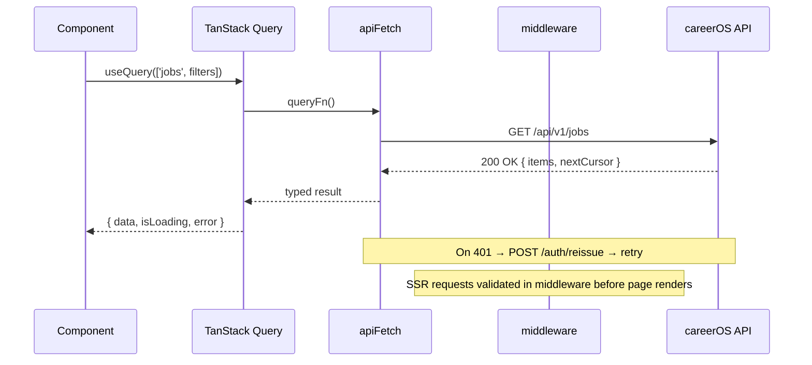

# Architecture Overview

🌐 **English** | [한국어](./architecture.ko.md)

---

## Layer Map

```
Browser
  └── Next.js 15 (App Router)
        ├── middleware.ts          — JWT guard, token refresh, role check
        ├── (public)/             — /login, /signup (no guard)
        ├── (auth)/layout.tsx     — AppShell (sidebar + topbar)
        │     └── pages           — TanStack Query hooks → apiFetch → careerOS API
        └── (admin)/layout.tsx    — AppShell + ADMIN role gate
```

---

## Data Flow



---

## File Structure

```
src/
├── app/
│   ├── (public)/
│   │   ├── login/page.tsx
│   │   └── signup/page.tsx
│   ├── (auth)/
│   │   ├── layout.tsx            ← AppShell (sidebar + topbar)
│   │   ├── dashboard/page.tsx
│   │   ├── jobs/
│   │   │   ├── page.tsx
│   │   │   └── [jobId]/page.tsx
│   │   ├── matches/
│   │   │   ├── page.tsx
│   │   │   └── [matchId]/page.tsx
│   │   ├── resume/page.tsx
│   │   ├── github/page.tsx
│   │   ├── candidate/page.tsx
│   │   ├── advisor/
│   │   │   ├── page.tsx
│   │   │   └── reports/[reportId]/page.tsx
│   │   ├── notifications/page.tsx
│   │   └── settings/page.tsx
│   ├── (admin)/
│   │   ├── layout.tsx            ← AdminShell (wraps AppShell + role gate)
│   │   └── admin/
│   │       ├── page.tsx          → /admin (redirect to /admin/users)
│   │       ├── users/page.tsx
│   │       ├── jobs/page.tsx
│   │       └── ai-calls/page.tsx
│   └── api/
│       └── auth/callback/route.ts
├── components/
│   ├── MatchScoreBadge.tsx
│   ├── JobCard.tsx
│   ├── CursorList.tsx
│   ├── ScoreBreakdownChart.tsx
│   ├── ResumeUploader.tsx
│   └── ui/                       ← layout + pattern primitives
│       ├── AppShell.tsx
│       ├── Sidebar.tsx
│       ├── Topbar.tsx
│       ├── Toast.tsx
│       ├── Modal.tsx
│       └── Spinner.tsx
├── lib/
│   └── api/
│       ├── client.ts             ← apiFetch wrapper
│       ├── auth.ts
│       ├── jobs.ts
│       ├── matches.ts
│       ├── resume.ts
│       ├── github.ts
│       ├── candidate.ts
│       ├── advisor.ts
│       ├── notifications.ts
│       ├── users.ts
│       ├── admin.ts
│       └── taxonomy.ts
├── stores/
│   ├── authStore.ts
│   └── notificationStore.ts
└── middleware.ts
```

---

## Auth Flow (End-to-End)

```
1. User visits /dashboard
2. middleware.ts reads access_token cookie
   a. Valid  → proceed to page
   b. Expired → POST /auth/reissue (refresh_token cookie)
              → success: set new access_token → proceed
              → failure: redirect /login?redirect=/dashboard
3. Page loads → (auth)/layout.tsx renders AppShell
4. Page component calls useQuery → apiFetch
5. If apiFetch gets 401 (race condition) → same reissue logic → retry once
```

---

## Error Handling Strategy

| Layer | Mechanism | Behavior |
|-------|-----------|----------|
| Network / API | `apiFetch` throws `ApiError` | Typed `code` + `message` from careerOS envelope |
| Query errors | TanStack Query `error` | Surfaces to component via `isError` |
| Component | `useEffect` on `isError` | Show toast notification |
| Page-level | React Error Boundary | `/error.tsx` fallback per route segment |
| Auth errors (401) | `apiFetch` retry logic | Auto-reissue → if fails: redirect `/login` |

---

## Loading Strategy

| Scenario | Pattern |
|----------|---------|
| List pages (jobs, matches) | Skeleton cards (3 placeholders) |
| Detail pages | Skeleton sections |
| Mutation buttons (save, hide, upload) | Inline spinner inside button |
| Full-page initial load | Skeleton via `loading.tsx` (Next.js) |

Do NOT show a full-screen spinner for any interaction. Inline loading states only.

---

## Key Constraints

- JWT is HTTP-only — never access `document.cookie` from JS
- All server state in TanStack Query — no `useState` for fetched data
- Cursor pagination only — no offset/page number anywhere
- Tailwind utility classes only — no custom CSS except `globals.css` token definitions
- No new npm packages without explicit decision — check existing deps first

---

[Wiki Index](README.md) | [Routing ▶](routing.md)
